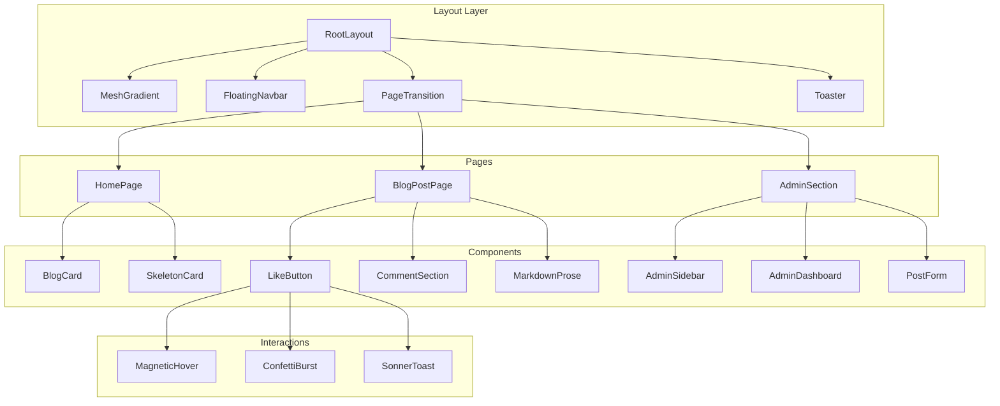

# Premium Minimalism Redesign Plan

## Overview

This document outlines the comprehensive redesign of the BLOGR platform from a "Cyberpunk/Neon" aesthetic to a "Premium Minimalist/Modern SaaS" aesthetic. The goal is to create a design that feels "expensive" and "engineered," not just "decorated."

## Current State Analysis

### Existing Design Characteristics
- **Background**: Deep blue-black (#050510) with cyan grid overlay
- **Colors**: Neon cyan (#00f2ff) and violet (#7000ff) with heavy glow effects
- **Typography**: Geist font family with monospace styling
- **Effects**: Neon glows, pulsing animations, scanlines, glassmorphism with colored borders
- **Components**: Grid background, glass cards with neon borders, cyberpunk-styled buttons

### Files to be Modified
| File | Purpose |
|------|---------|
| [`globals.css`](src/app/globals.css) | Color system, utilities, prose styles |
| [`layout.tsx`](src/app/layout.tsx) | Root layout, fonts, background |
| [`Navbar.tsx`](src/components/Navbar.tsx) | Navigation component |
| [`BlogCard.tsx`](src/components/BlogCard.tsx) | Blog post cards |
| [`LikeButton.tsx`](src/components/LikeButton.tsx) | Like interaction |
| [`page.tsx`](src/app/page.tsx) | Home page |
| [`blog/[slug]/page.tsx`](src/app/blog/[slug]/page.tsx) | Blog post page |
| [`admin/page.tsx`](src/app/admin/page.tsx) | Admin dashboard |
| [`admin/login/page.tsx`](src/app/admin/login/page.tsx) | Admin login |
| [`GridBackground.tsx`](src/components/GridBackground.tsx) | Background component |
| [`PageTransition.tsx`](src/components/PageTransition.tsx) | Page transitions |

---

## Design System Specification

### Color Palette

```css
:root {
  /* Background */
  --background: #030303;           /* Rich Black */
  --background-elevated: #0a0a0a;  /* Elevated surfaces */
  
  /* Text */
  --text-primary: #fafafa;         /* High contrast headings */
  --text-secondary: #94a3b8;       /* Slate-400 for body */
  --text-muted: #64748b;           /* Slate-500 for subtle text */
  
  /* Borders */
  --border-subtle: rgba(255, 255, 255, 0.06);
  --border-default: rgba(255, 255, 255, 0.1);
  --border-hover: rgba(255, 255, 255, 0.15);
  
  /* Accent - Electric Blue */
  --accent: #3b82f6;               /* Blue-500 */
  --accent-soft: rgba(59, 130, 246, 0.1);
  --accent-glow: rgba(59, 130, 246, 0.2);
  
  /* Glass */
  --glass-bg: rgba(255, 255, 255, 0.02);
  --glass-blur: 20px;
}
```

### Typography

- **Font Family**: Inter or Geist (already using Geist)
- **Headings**: Bold, large, airy with tight letter-spacing
- **Body**: Regular weight, slate-400 color, relaxed line-height
- **Monospace**: Only for code, timestamps, or technical data

### Spacing & Radius

- **Card Radius**: 12px (rounded-xl)
- **Button Radius**: 8px (rounded-lg) or full for pills
- **Spacing Scale**: 4px base unit

---

## Phase 1: Foundation & Dependencies

### 1.1 Install New Dependencies

```bash
npm install sonner canvas-confetti
npm install -D @types/canvas-confetti
```

**Packages:**
- **sonner**: Elegant toast notifications
- **canvas-confetti**: Celebration effect for likes

### 1.2 Update [`globals.css`](src/app/globals.css)

**Remove:**
- Neon glow utilities (`.neon-cyan`, `.neon-violet`, `.text-neon-*`)
- Neon pulse animation
- Cyberpunk prose styles
- Cyan/violet color variables

**Add:**
- Premium minimalism color system
- Subtle shadow utilities
- New prose styles for premium look
- Skeleton loader animations
- Smooth scrollbar styling

### 1.3 Create [`MeshGradient.tsx`](src/components/MeshGradient.tsx)

A slow-moving, subtle gradient in the background corner:
- Opacity: 0.03-0.05
- Colors: Soft blue/purple blend
- Animation: Slow drift using CSS animation

---

## Phase 2: Core Layout Components

### 2.1 Redesign [`Navbar.tsx`](src/components/Navbar.tsx) - Floating Dock

**Current:** Sticky nav with glass effect and neon border

**New Design:**
```
┌─────────────────────────────────────────────────────────┐
│                                                         │
│         ┌─────────────────────────────────┐             │
│         │  ◈ BLOGR    HOME   ADMIN →     │             │
│         └─────────────────────────────────┘             │
│                   (floating dock)                       │
└─────────────────────────────────────────────────────────┘
```

**Features:**
- Centered floating dock with rounded-full corners
- Subtle backdrop-blur and border
- Magnetic hover effect on buttons
- Clean icon + text layout

### 2.2 Update [`PageTransition.tsx`](src/components/PageTransition.tsx)

**Current:** Simple fade with blur

**New:**
- Spring-based physics animation
- Staggered children support
- Shared layout animations for blog cards

### 2.3 Create [`Skeleton.tsx`](src/components/Skeleton.tsx)

Skeleton loader components:
- `SkeletonText` - for text lines
- `SkeletonCard` - for blog card placeholder
- `SkeletonImage` - for image placeholders

### 2.4 Create [`Layout.tsx`](src/components/Layout.tsx)

Wrapper component that:
- Handles page transitions
- Includes background components
- Provides consistent spacing

---

## Phase 3: Home Page Redesign

### 3.1 Hero Section

**Current:** Cyberpunk-themed with neon text and "LIVE TRANSMISSION" badge

**New Design:**
```
┌─────────────────────────────────────────────────────────┐
│                                                         │
│                    ◈ BLOGR                              │
│                                                         │
│              Thoughts, Curated.                         │
│                                                         │
│      A minimal space for ideas that matter.             │
│                                                         │
└─────────────────────────────────────────────────────────┘
```

**Typography:**
- Logo: Small, subtle icon + wordmark
- Heading: "Thoughts, Curated." - 4xl/5xl, font-bold
- Subtitle: Slate-400, text-lg

### 3.2 Blog Card Redesign

**Current:** Glass card with cyan border, neon hover effects

**New Design:**
```
┌───────────────────────────────────────────┐
│                                           │
│  Post Title Goes Here                     │
│  ─────────────────────────────────────    │
│  Brief excerpt of the post content...     │
│                                           │
│  Feb 22, 2026    ♥ 12    💬 4      →     │
└───────────────────────────────────────────┘
```

**Features:**
- 1px border: `rgba(255,255,255,0.1)`
- Subtle shadow on hover
- No neon glows
- Clean typography hierarchy
- Arrow animation on hover

### 3.3 Staggered Fade-in Animation

Using Framer Motion for the blog list:
```tsx
const container = {
  hidden: { opacity: 0 },
  show: {
    opacity: 1,
    transition: { staggerChildren: 0.1 }
  }
};

const item = {
  hidden: { opacity: 0, y: 20 },
  show: { opacity: 1, y: 0 }
};
```

---

## Phase 4: Blog Post Page Redesign

### 4.1 Post Layout

**Current:** Cyan-themed with neon text shadows

**New Design:**
- Clean, readable typography
- Subtle divider lines
- Proper prose styling
- Minimal chrome

### 4.2 Like Button with Magnetic Hover

**Features:**
- Magnetic effect: Button slightly follows cursor within a radius
- Confetti burst on click
- Sonner toast: "Post liked! ♥"
- Smooth scale animation

### 4.3 Toast Notifications

Add Toaster component to layout:
```tsx
import { Toaster } from "sonner";

// In layout
<Toaster 
  position="bottom-right"
  toastOptions={{
    style: {
      background: '#0a0a0a',
      border: '1px solid rgba(255,255,255,0.1)',
      color: '#fafafa'
    }
  }}
/>
```

---

## Phase 5: Admin Section Redesign

### 5.1 Admin Layout - Sidebar Navigation

**Current:** Top nav with AdminNav component

**New Design:**
```
┌────────┬────────────────────────────────────────────────┐
│        │                                                │
│  ◈     │    Dashboard                                   │
│        │    ──────────────────────────────────          │
│  📄    │                                                │
│  ➕    │    [Post cards and stats here]                 │
│  ⚙️    │                                                │
│  🚪    │                                                │
│        │                                                │
└────────┴────────────────────────────────────────────────┘
  64px              Main content area
```

**Features:**
- Icon-only sidebar (64px width)
- Clean, minimal icons (Lucide thin variant)
- Hover tooltips
- Active state indicator

### 5.2 Admin Login - Glass Card

**Current:** Violet-themed with neon effects

**New Design:**
```
┌─────────────────────────────────────────────────────────┐
│                                                         │
│                   ┌───────────────┐                     │
│                   │      🔐       │                     │
│                   │               │                     │
│                   │  Admin Access │                     │
│                   │               │                     │
│                   │  [password]   │                     │
│                   │               │                     │
│                   │ [Authenticate]│                     │
│                   └───────────────┘                     │
│                                                         │
└─────────────────────────────────────────────────────────┘
```

**Features:**
- Centered glass card
- Zero clutter
- Subtle border and shadow
- Clean form styling

---

## Phase 6: Polish & Refinement

### 6.1 Markdown Prose Styles

Update `.prose-cyberpunk` to `.prose-premium`:
- Clean heading hierarchy
- Subtle code blocks
- Proper link styling
- Blockquote design

### 6.2 Hover-Parent Interactions

Use Tailwind's `group` and `peer` classes:
```tsx
<div className="group">
  <h2 className="group-hover:text-white transition-colors">
    Title
  </h2>
  <p className="text-slate-400 group-hover:text-slate-300">
    Excerpt
  </p>
</div>
```

### 6.3 Final Touches

- Consistent border radius throughout
- Proper focus states for accessibility
- Smooth transitions (150-200ms)
- Loading states for all async operations

---

## Architecture Diagram



---

## Implementation Order

1. **Dependencies** - Install sonner, canvas-confetti
2. **globals.css** - New color system and utilities
3. **MeshGradient** - New background component
4. **Navbar** - Floating dock redesign
5. **PageTransition** - Spring animations
6. **Skeleton** - Loading components
7. **BlogCard** - Premium card design
8. **HomePage** - Hero and staggered list
9. **BlogPostPage** - Clean post layout
10. **LikeButton** - Magnetic + confetti
11. **AdminLogin** - Glass card design
12. **AdminDashboard** - Sidebar layout
13. **Prose Styles** - Markdown styling
14. **Final Polish** - Consistency pass

---

## Key Differences Summary

| Aspect | Current Cyberpunk | New Premium Minimalism |
|--------|------------------|----------------------|
| Background | #050510 + cyan grid | #030303 + subtle mesh |
| Primary Color | Neon cyan #00f2ff | Electric blue #3b82f6 |
| Borders | Colored neon borders | Subtle white rgba borders |
| Text | Monospace, neon glows | Geist, slate-400 body |
| Cards | Glass + neon hover | Subtle shadow + border |
| Animations | Pulse, scanlines | Spring physics, stagger |
| Navigation | Sticky glass bar | Floating dock |
| Admin | Top nav | Icon sidebar |
| Notifications | None | Sonner toasts |
| Like Button | Simple scale | Magnetic + confetti |

---

## Questions for Clarification

Before proceeding with implementation, I have a few questions:

1. **Accent Color**: The plan uses Electric Blue (#3b82f6). Would you prefer a different accent color like Silver/Gray or perhaps a soft Purple?

2. **Font Preference**: Currently using Geist. Should we switch to Inter, or keep Geist?

3. **Animation Intensity**: How subtle should the animations be? Very minimal (Linear-style) or slightly more pronounced?

4. **Admin Sidebar**: Should the sidebar be collapsible to full-width on mobile, or always hidden on mobile with a hamburger menu?

5. **Blog Post Images**: Do posts have cover images? If so, should we implement the "expand on click" layout transition?